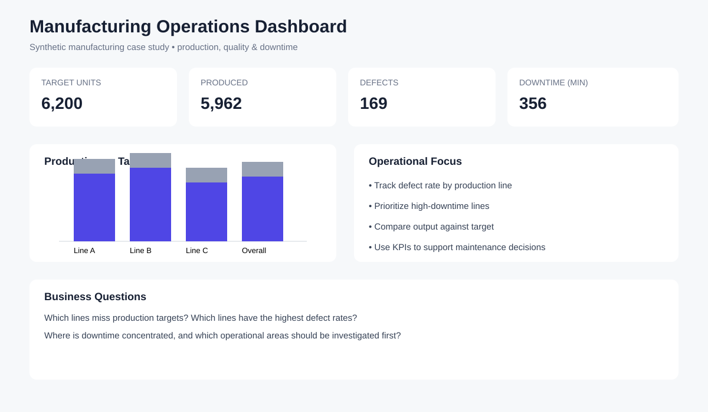

# 🏭 Manufacturing Production & Quality Analytics

A synthetic manufacturing case study that connects production operations with data analysis and KPI-driven decision making.

> **Data note:** The dataset is synthetic and contains no confidential company information.

## 🎯 Business Problem

Management needs a simple view of production performance, target achievement, defects, and downtime so that operational issues can be prioritized.

## 📊 KPIs

- Production Target: **6,200 units**
- Units Produced: **5,962 units**
- Target Achievement: **96.16%**
- Defects: **169 units**
- Defect Rate: **2.83%**
- Downtime: **356 minutes**

## 🔎 Business Questions

- Which production lines miss their targets?
- Where are defects concentrated?
- Where is downtime concentrated?
- Which operational issues should management investigate first?

## 🛠️ Tools

Excel · SQL · Power BI · Python

## 📁 Project Structure

- `data/manufacturing_data.csv` — synthetic source data
- `assets/manufacturing-dashboard-preview.svg` — dashboard concept/preview

## 💼 Why This Project Matters

This project demonstrates how manufacturing domain knowledge can be combined with Data Analysis to create operational KPIs and support decisions around production, quality, and maintenance.

## ⚠️ Reproducibility

The dataset is intentionally synthetic and small enough to reproduce manually or with SQL/Python. The dashboard preview is a portfolio visualization; a native `.pbix` file can be added after building the report in Power BI Desktop.
