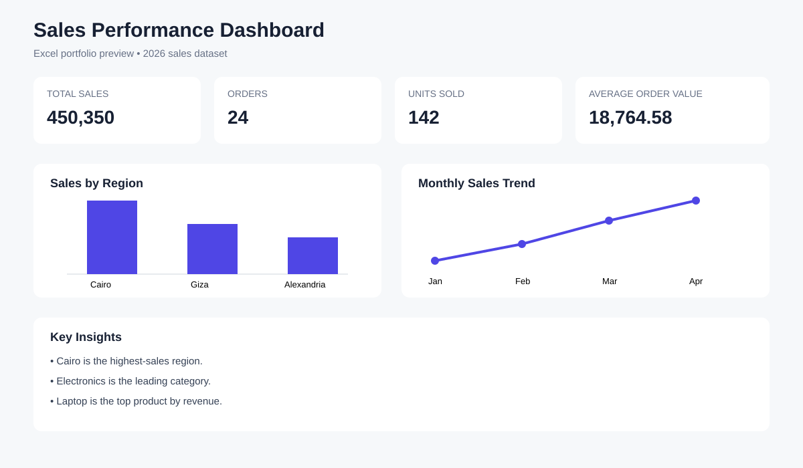

# 📈 Power BI Sales Dashboard

A Business Intelligence dashboard specification based on the shared sales dataset.

## 🎯 Business Goal

Give a decision-maker a one-page view of revenue, order volume, product performance, regional performance, and monthly trends.

## 📊 KPI Layer

- Total Sales — **450,350**
- Total Orders — **24**
- Total Quantity — **142**
- Average Order Value — **18,764.58**

## 📈 Visual Layer

- Monthly sales trend
- Sales by region
- Sales by category
- Top products
- Region/category slicers

## 🧠 Recommended Data Model

For a production Power BI solution, the current sales table can be expanded into a star schema with:

- FactSales
- DimDate
- DimProduct
- DimRegion
- DimCategory

## 📁 Source

`../excel-sales-analysis/data/sales_data.csv`

## ⚠️ Important Portfolio Note

The visual above is a **dashboard preview**, not a native Power BI screenshot. The `.pbix` file should be created and validated in Power BI Desktop before being presented as a completed Power BI deliverable. This keeps the portfolio accurate and interview-safe.
